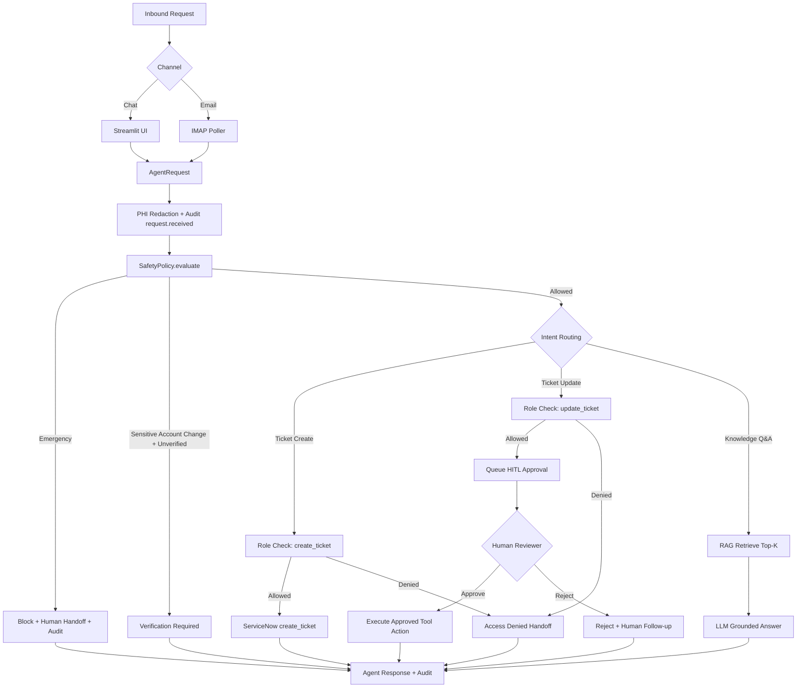

# AcmeCloud Customer Support Agent

AcmeCloud is a healthcare-safe customer support agent built for omnichannel intake (chat + email), retrieval-augmented responses, constrained tool execution, and explicit Human-in-the-Loop (HITL) decision points.

The design goal is to resolve common support requests end-to-end when safe, while escalating high-risk, sensitive, or policy-restricted actions to human representatives.

## UI Preview


## 1. Core Objectives

- Fast first response for chat users with deterministic guardrails.
- Grounded policy/product answers via RAG (ChromaDB).
- Controlled ticket operations through ServiceNow-style tools.
- Explicit approval and handoff workflows for safety and quality.
- Full auditability of request, decision, action, and outcome.
- Role-based access constraints on tool/data usage.

## 2. High-Level Architecture

Runtime layers:

1. Channel Layer
- `streamlit_app.py` for interactive chat.
- `app/email_ingest.py` for inbound support mailbox polling via IMAP.

2. Orchestration Layer
- `app/agent.py` contains routing, policy enforcement integration, tool invocation, and response assembly.

3. Safety & Access Layer
- `app/policy.py` implements emergency detection, verification triggers, and role-based tool access matrix.

4. Knowledge Layer
- `app/rag.py` owns ingestion, chunking, vector storage (ChromaDB), and top-k retrieval.

5. Action Layer
- `app/tools.py` abstracts ServiceNow ticket creation/update and mock-vs-real execution behavior.

6. Observability Layer
- `app/audit.py` writes append-only JSONL audit records for traceability.

7. Configuration Layer
- `app/config.py` loads environment variables and normalizes runtime paths/settings.

## 3. Request Processing Flow Diagram



## 4. Script-Level Technical Breakdown

### `streamlit_app.py`
Purpose: primary operator/user-facing chat console and HITL approval surface.

Key responsibilities:
- Initializes single in-session agent instance (`AcmeCloudSupportAgent`).
- Captures context attributes (`user_id`, `user_role`, `verified`, optional `ticket_id`).
- Submits chat turns as normalized `AgentRequest` objects.
- Renders assistant output and action label for transparency.
- Maintains approval queue state for pending sensitive actions.
- Allows explicit `Approve` / `Reject` on queued actions.
- Executes approved actions through agent orchestration method.
- Emits audit events for queueing, approval, and rejection outcomes.

Why it matters:
- Makes HITL explicit and operationally testable.
- Separates �agent proposes action� from �human authorizes action.�

---

### `app/agent.py`
Purpose: orchestration brain that applies safety/access constraints before any deep action.

Data contracts:
- `AgentRequest`: channel, user identity, role, message, verification status, optional ticket context.
- `AgentResponse`: output text + action classification + escalation/approval metadata.

Execution sequence (`handle_request`):
1. Redacts likely sensitive tokens in inbound text (`mask_possible_phi`).
2. Writes `request.received` audit event.
3. Runs policy decision (`SafetyPolicy.evaluate`).
4. Handles terminal safety cases:
- Emergency -> immediate handoff response.
- Verification required -> approval/verification prompt.
5. Performs intent branching:
- Ticket create path.
- Ticket update path (with role check + HITL queue creation).
- RAG answer path.
6. Writes response-level audit event with source list when applicable.

Additional behavior:
- `execute_approved_action` executes pending payloads only after human approval.
- LLM fallback path gracefully degrades on provider errors and recommends handoff/ticketing.

Why it matters:
- Centralized policy-first orchestration minimizes accidental unsafe automation.

---

### `app/policy.py`
Purpose: codifies safety/compliance and access control decisions.

Implemented controls:
- Emergency keyword detection (hard-stop + human escalation).
- Sensitive account-change detection (verification gating).
- Role-based tool access matrix (`TOOL_ACCESS_MATRIX`) for:
  - `create_ticket`
  - `update_ticket`
  - `kb_access`

Key helper methods:
- `SafetyPolicy.evaluate(message)` returns structured `PolicyDecision`.
- `is_tool_allowed(role, tool_name)` enforces per-role capabilities.
- `verification_prompt(user_id)` standardizes pre-change verification ask.

Why it matters:
- Keeps policy logic decoupled from UI and tool implementation.
- Easier to audit/extend with additional compliance rules.

---

### `app/rag.py`
Purpose: retrieval layer for grounded support answers.

Key components:
- Persistent Chroma client bound to `CHROMA_DIR`.
- Collection: `acmecloud_kb`.
- Default embedding function (Chroma-managed).

Ingestion behavior:
- Loads `.txt` and `.md` docs from `KB_DIR`.
- Splits documents into overlapping chunks (`chunk_size=700`, `overlap=120`).
- Upserts chunks with source metadata for citation.

Query behavior:
- Vector similarity top-k retrieval.
- Returns structured docs with `doc_id`, text, and source filename.

Why it matters:
- Reduces hallucination risk by grounding responses in local knowledge sources.

---

### `app/ingestion.py`
Purpose: command-line indexing entrypoint.

What it does:
- Instantiates `KnowledgeBase`.
- Ingests all supported files in `KB_DIR`.
- Prints ingested chunk count.

Typical use:
- Run after adding/updating policy/product documents.
- Run during deployment or nightly sync jobs.

---

### `app/tools.py`
Purpose: controlled adapter for ServiceNow ticket operations.

Supported operations:
- `create_ticket(user_id, summary, details)`
- `update_ticket(ticket_id, updates)`
- `add_worknote(ticket_id, note)`

Reliability model:
- `ENABLE_EXTERNAL_TOOL_CALLS=false`: safe local mock mode with deterministic responses.
- `ENABLE_EXTERNAL_TOOL_CALLS=true`: real HTTP calls to `SERVICENOW_INSTANCE`.
- Exceptions are caught and returned as structured failures with fallback intent.

Why it matters:
- Allows progressive hardening from local simulation to real integration.
- Prevents unhandled tool exceptions from breaking user interaction.

---

### `app/email_ingest.py`
Purpose: inbound email pipeline for support DL processing.

Operational modes:
1. Real IMAP mode (when IMAP settings are present):
- Connects over SSL.
- Selects mailbox/folder.
- Fetches unseen messages up to `IMAP_POLL_LIMIT`.
- Decodes sender, subject, and text body.
- Converts each email into `AgentRequest` and processes via same agent path.

2. Fallback sample mode:
- Uses bundled sample messages if IMAP credentials/host are absent.

Outputs:
- Per-run results saved to `logs/email_results.json`.
- Audit event `email.processed` emitted for each message.

Why it matters:
- Ensures parity between chat and email handling semantics.

---

### `app/audit.py`
Purpose: append-only audit logging.

Format:
- One JSON object per line (JSONL) containing:
  - UTC timestamp
  - event type
  - actor
  - payload

Common events:
- `request.received`
- `request.blocked`
- `response.generated`
- `approval.requested`
- `approval.queued`
- `approval.approved`
- `approval.rejected`
- `tool.*`
- `email.processed`

Why it matters:
- Enables post-incident review, compliance evidence, and debugging.

---

### `app/config.py`
Purpose: centralized runtime configuration.

Reads from `.env`:
- OpenAI model/key.
- Chroma and KB paths.
- Audit file path.
- Support DL metadata.
- ServiceNow endpoint and credentials.
- External-tool-call toggle.
- IMAP host/port/credentials/folder/poll-limit.

Startup behavior:
- Ensures key directories exist for vector data, KB docs, and logs.

## 5. Environment Variables

Primary values (in `.env` / `.env.example`):

- `OPENAI_API_KEY`
- `OPENAI_MODEL`
- `CHROMA_DIR`
- `KB_DIR`
- `AUDIT_LOG_FILE`
- `SUPPORT_EMAIL_DL`
- `SERVICENOW_INSTANCE`
- `SERVICENOW_USERNAME`
- `SERVICENOW_PASSWORD`
- `ENABLE_EXTERNAL_TOOL_CALLS`
- `IMAP_HOST`
- `IMAP_PORT`
- `IMAP_USERNAME`
- `IMAP_PASSWORD`
- `IMAP_FOLDER`
- `IMAP_POLL_LIMIT`

## 6. Setup and Execution

### Install dependencies
```bash
pip install -r requirements.txt
```

### Configure runtime
```bash
copy .env.example .env
# then fill real credentials/hosts
```

### Ingest knowledge base
```bash
python -m app.ingestion
```

### Launch chat UI
```bash
streamlit run streamlit_app.py
```

### Process inbound emails
```bash
python -m app.email_ingest
```

## 7. Access Control Model (Current)

- `member`
  - Allowed: KB answers, ticket create
  - Blocked/approval flow: direct ticket update
- `provider`
  - Allowed: KB answers, ticket create, ticket update (with HITL flow where configured)
- `admin`
  - Allowed: full tool path in current implementation
- `guest`
  - Allowed: KB answers only
  - Blocked: ticket tool operations

Note: This matrix is intentionally conservative for healthcare support safety.

## 8. Safety and Compliance Controls

Implemented safeguards:
- PHI/PII token masking placeholder before downstream handling.
- Emergency-intent hard stop with immediate escalation messaging.
- Verification requirement before sensitive account changes.
- Policy-first role checks before tool execution.
- Grounding preference via RAG for factual support answers.
- Structured audit trail across all major decisions/actions.

## 9. Reliability and Degradation Strategy

- Tool adapter catches failures and returns structured fallback outcomes.
- Agent responds gracefully when external LLM/tool calls fail.
- Email intake supports fallback sample mode when IMAP is unavailable.
- External ServiceNow calls can be disabled for deterministic local operation.

## 10. Repository Structure

```text
AcmeCloud/
  app/
    __init__.py
    config.py
    policy.py
    audit.py
    rag.py
    tools.py
    agent.py
    ingestion.py
    email_ingest.py
  data/
    kb/
      policy_docs.md
  logs/
  vector_store/
  streamlit_app.py
  requirements.txt
  .env
  .env.example
  README.md
```

## 11. Operational Notes

- Keep `ENABLE_EXTERNAL_TOOL_CALLS=false` during development.
- Use a least-privileged mailbox user for IMAP polling.
- Rotate API and mailbox credentials regularly.
- Treat `logs/audit.log` as sensitive operational data.
- Re-run ingestion whenever KB docs change materially.

## 12. Current Gaps and Next Hardening Steps

Recommended production upgrades:
- Replace keyword emergency detection with classifier + confidence threshold.
- Add robust PHI/PII detection/redaction service.
- Add signed approval records (reviewer id, reason code, immutable event id).
- Add retry/backoff/circuit-breaker around external tool calls.
- Add role-scoped retrieval filters for document-level access control.
- Add automated tests for policy matrix and HITL transitions.

